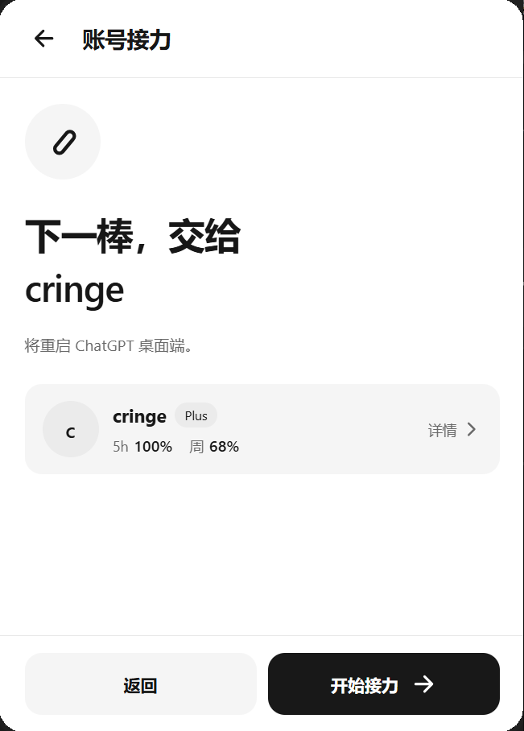
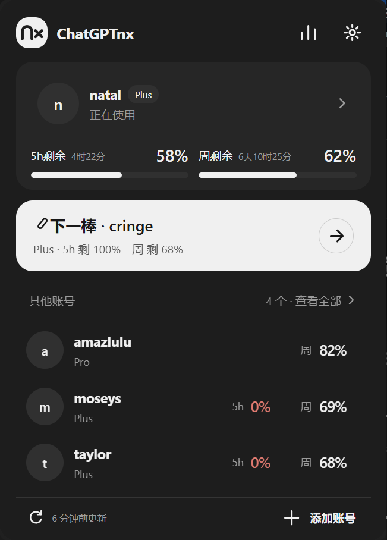
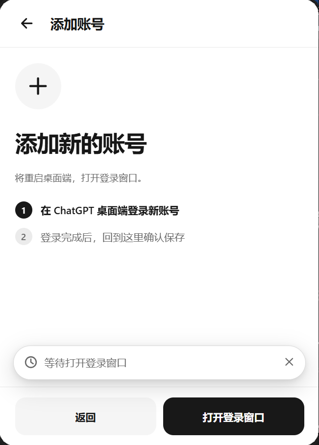

[简体中文](README.md) | **English**

<h1>ChatGPTnx</h1>

<b>Automatic handoff · Task continuation · Configure n accounts for your workload</b>

Keep a long task moving across the accounts you own. Switch accounts when quota runs out, then attempt to continue the original task.

ChatGPTnx is a lightweight Windows desktop utility that reduces the waiting and manual steps when a long task is interrupted by an account's usage limit. It brings account handoff, task continuation, quota information, and usage statistics into one tray app.

## Video introduction

Chinese narration and subtitles.

https://github.com/user-attachments/assets/e1d24f80-0716-4bba-a024-7058e5c0b2e0

## Features

- **Automatic handoff:** Switch to a participating account with available quota when the current account runs out. You can also switch manually, choose participating accounts, or schedule a cancellable handoff after an account's quota recovers.
- **Start windows early:** Choose Plus accounts and start their five-hour windows with a tiny request when desktop work begins, without changing the desktop login. Off by default, with no repeat requests within the same window.
- **Task continuation:** After a switch, attempt to resume the original desktop task. Configure a continuation message and review successful, skipped, and unresolved results separately. Identified background agents do not trigger independent desktop continuation.
- **Quotas and usage:** See each account's remaining quota, reset times, and token usage. Queries pause or wait longer according to the error type, avoiding repeated requests during failures.
- **Credential protection and diagnostics:** Protect account snapshots with Windows current-user encryption, and preview or copy a redacted diagnostic summary.
- **Lightweight desktop controls:** Keep the app in the Windows tray, with notifications, keyboard shortcuts, and light and dark themes.

### Keeping long tasks moving

Automatic handoff and task continuation are separate settings. When the current account reaches its limit, handoff switches to an eligible account. Continuation then checks the original desktop task and attempts to resume it there. Continuation depends on the task's state and may wait or report a failure; it cannot guarantee that every task will resume.

**n is the number of your own accounts you choose to configure for your workload.** Start with a few and adjust the participating accounts as your usage changes. For example, five Plus accounts can take turns in a rotation so a long task spends less time waiting for one account's quota to reset.

The quota overview and usage statistics help you see which account is available and how much capacity you actually use.

## Screenshots

### Account handoff and task continuation

| Home · Current account and next handoff | Account handoff · Confirm the next account | Task continuation · Review results |
| --- | --- | --- |
|  |  |  |

### Quotas and usage

| Quota overview | Personal usage | Account details |
| --- | --- | --- |
|  |  |  |

### Settings and appearance

| Settings | Dark theme | Add an account |
| --- | --- | --- |
|  |  |  |

## Download and run

Download `ChatGPTnx.exe` from the [v1.0.1 release](https://github.com/LUMIAO9527/ChatGPTnx/releases/tag/v1.0.1). The release also provides `ChatGPTnx-v1.0.1-source.zip` for source inspection. You need 64-bit Windows 10 or 11, the installed ChatGPT desktop app with a signed-in account, and Microsoft Edge WebView2 Runtime.

1. Put the EXE in its own writable folder and launch it. Open the panel from the system tray.
2. Select **Add account** and follow the prompt to open the desktop sign-in window. After signing in to an account you own, return to the panel and confirm the account to save it.
3. Try one manual handoff with **Next account**. Then enable automatic handoff in Settings and choose the participating accounts.
4. Enable **Automatically continue tasks after switching accounts** if you want task continuation. Configure a continuation message if needed, and check the task continuation records for results.

Closing the panel only hides it; the app keeps running in the tray. Use the tray menu to exit completely.

## Data and privacy

Account snapshots, archived snapshots, and transaction recovery backups use Windows current-user encryption and restricted file permissions. Encrypted snapshots cannot be copied directly to another Windows user. The official desktop app's active authentication file keeps its existing format.

Account and runtime data are stored next to the EXE. Keep that folder private and do not upload it publicly. When reporting an issue, use the diagnostic summary in Settings. It excludes email addresses, tokens, task content, and local paths, and is never uploaded automatically.

See [USAGE.md](USAGE.md) (Chinese) for query recovery, continuation behavior, and rollback instructions. Before restoring an executable that cannot read encrypted snapshots, restore the credential format using the documented recovery tool.

## License

The source is available to inspect. Use and redistribution are governed by the [LICENSE](LICENSE); all rights are reserved. ChatGPTnx is an independent tool and is not affiliated with or endorsed by OpenAI.
