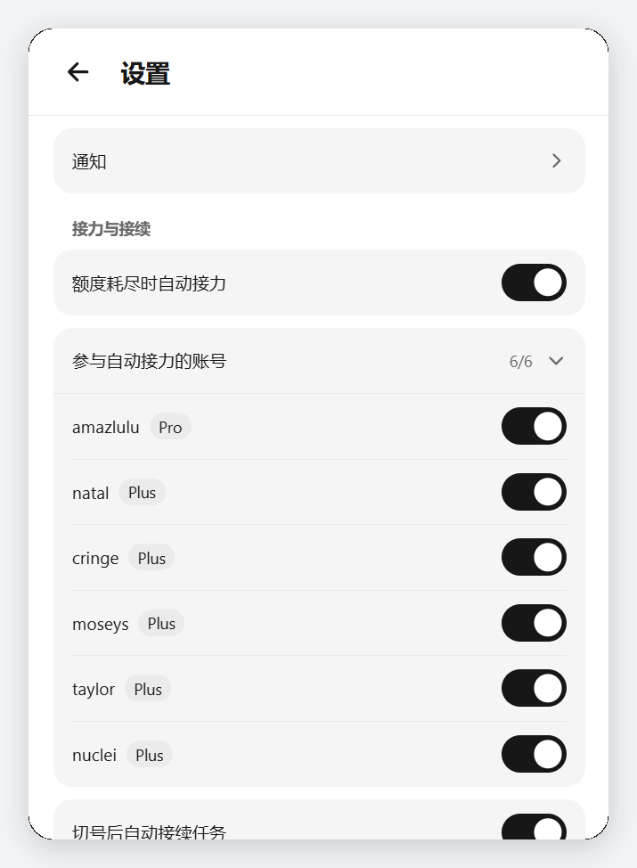
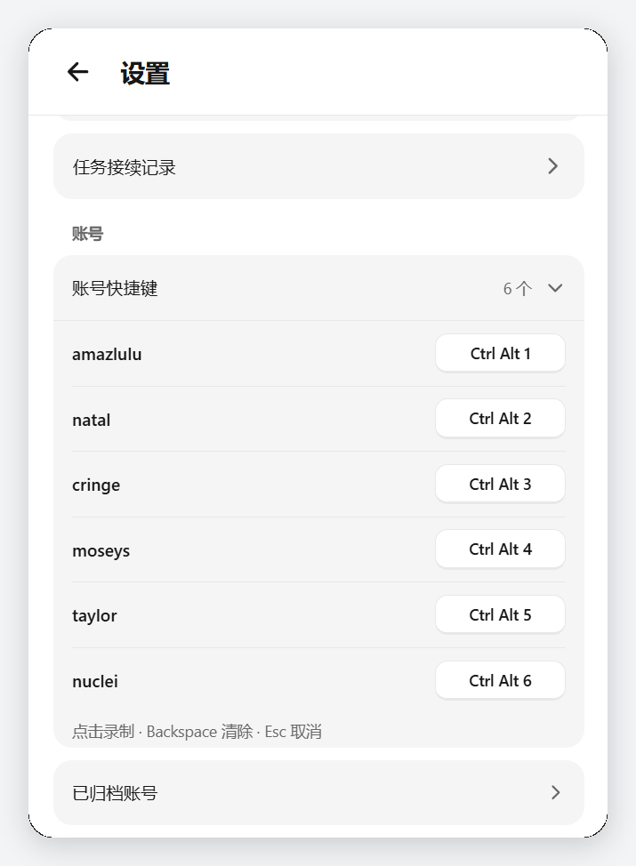
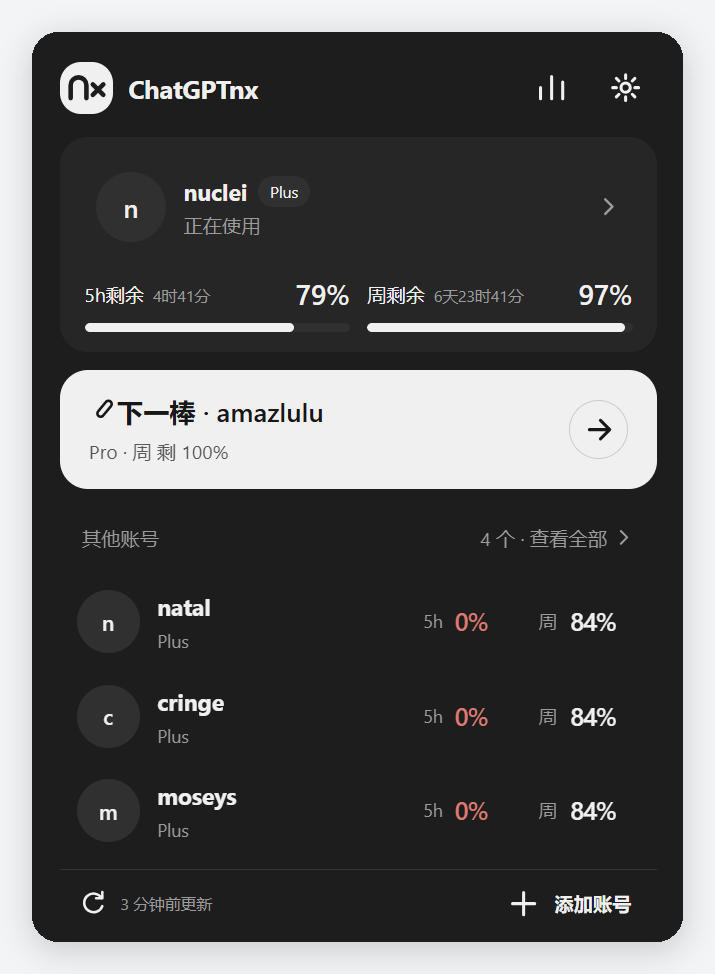

<h1>ChatGPTnx</h1>

<b>多账号额度面板 · 自动接力 · 任务接续</b>

Windows 托盘工具：集中查看多个自有 ChatGPT / Codex 账号的额度与用量， 
额度耗尽时按规则切换到下一个账号，并尝试把受影响的桌面任务接续下去。

---

ChatGPTnx 是一个常驻托盘的本机工具，把多个自有账号的额度、用量和切换动作收在同一个 372×520 的面板里。它不做代理、不转发流量，也不修改客户端：账号状态保存在 EXE 同目录，额度来自本机已登录的 ChatGPT / Codex 桌面端。

它只处理你自己的账号：你登录哪个账号，就统计哪个账号；切换、接续都在本机完成。

## 功能

**额度看板**

- 首页卡片按接口实际返回的额度窗口显示 5 小时 / 周额度、剩余比例与重置时间，不按套餐补齐窗口；查询失败显示"额度暂不可用"，不以 0 代替未知。
- 账号详情复用同一张额度卡，并列出 Credits 余额、可用重置次数与会员到期日；缺失、零值、异常分别呈现，读不到的重置次数详情不会编造。
- 额度总览支持按接力顺序、5h 额度、5h 重置时间、周额度、周重置时间排序，直接列出各账号主要额度。

**接力（自动切号）**

- "下一棒"给出建议账号，手动接力始终可用；自动接力是独立开关，可逐账号选择是否参与，未参与的账号不影响手动切号。
- 没有有效候选时保持等待，失效缓存不会被当成可用账号；当前账号接近耗尽时单独提高刷新频率。

**任务接续**

- "切号后自动接续任务"与自动接力分开控制。它只操作当前会话中能够明确识别的现有 ChatGPT 桌面窗口和原任务，不启动另一套任务服务、浏览器或深链接实例。
- 执行顺序：确认原账号切换完成且任务待续 → 定位原窗口与原任务 → 优先点击原生继续按钮；没有按钮时，先在空输入区追加配置的接续消息（1–200 个可打印字符、单行），回读核对后再发送。
- 不清空、不全选替换、不注入剪贴板、不模拟回车。检测到真实草稿、附件或持续输入时进入"等待输入区就绪"，每 15 秒复查、单次等待最长 5 分钟，绝不覆盖你正在输入的内容。
- 发送阶段使用短暂的系统输入保护并配独立看门狗，先确认空闲才执行，正常路径立即释放；保护失败不提权、不发送。发送后需观察到原任务的新回合才算成功，结果未确认时不因超时或重启盲目重发。
- 记录按任务单行展示 `0/1` 或 `1/1` 进度并保留原因；历史按时间收纳，最多保留 20 次 / 7 天。清理只删除已结束的记录，不动桌面任务。

**用量统计**

- 个人用量支持 7 天 / 30 天 / 180 天 / 全部范围，以及按账号查看；包含累计 Token 数、每日趋势、单日峰值、连续使用天数与日均用量。
- 没有记录的日期不会被当成 0；精确 Token 数值原样保留。

**设置与操作**

- 设置分为系统、接力与接续、账号三个一级分组，外观、通知、参与账号、接续消息、快捷键、已归档账号原地互斥展开，切换时保留未保存的输入。
- 开关立即反转、后台按最后选择保存，写入失败会回退并提示。账号快捷键为 Ctrl / Alt / Shift 中至少两个修饰键加 1–9，可录制、可清除。
- 全局固定 372×520 单一面板：长内容内部滚动，没有精简模式或多套布局。

## 界面

> 以下界面图截取自本机运行中的实例（v5.7.6 · 2026-09-27 构建），面板固定 372×520。

| 首页 · 当前账号与下一棒 | 额度总览 · 接力顺序 |
| --- | --- |
|  |  |

| 账号详情 · 额度 / Credits / 重置次数 | 个人用量 · 总量与趋势 |
| --- | --- |
|  |  |

| 设置 · 系统 / 接力与接续 / 账号 | 参与自动接力的账号 |
| --- | --- |
|  |  |

| 任务接续记录 | 账号快捷键 |
| --- | --- |
|  |  |

| 深色外观 |
| --- |
|  |

## 下载与运行

系统要求：Windows 10 / 11 64 位、已安装并登录的 ChatGPT 桌面应用、Microsoft Edge WebView2 Runtime（Windows 11 通常已自带）。运行 EXE 不需要安装 Python。

1. 从本仓库的 **Releases** 页面下载 `ChatGPTnx.exe`，并按 Release 说明核对 SHA-256。
2. 放到一个独立且可写的目录后双击启动（也可以先放好再创建桌面快捷方式）；托盘出现图标后，左键即可打开面板。
3. 在 ChatGPT 桌面端登录你自己的账号，再用面板里的"添加账号"保存。请只添加你有权使用的账号。
4. 先手动刷新、手动接力，确认无误后再分别开启自动接力与任务接续。

关闭面板只是收起界面，程序仍在托盘运行；需要彻底退出时使用托盘菜单。升级时先退出旧程序、备份运行目录，并注意桌面端重启会影响进行中的对话。

## 数据与隐私

`accounts.txt`、`snapshots/`、`_data/` 位于 EXE 同目录，包含账号标识、认证状态、任务标题与运行日志，**不会随程序一起分发，也不属于公开内容**。自动接力开启期间，待续任务会长期保存在 `_data/resume.json`。

提 Issue 或反馈时，请先删除邮箱、令牌、任务 ID、标题与本机路径；不要上传运行目录、原始日志或真实界面截图。

## 已知边界

- 本工具依赖 ChatGPT / Codex 桌面应用的现有行为与额度接口，桌面版本更新或接口结构变化可能影响额度读取、切号与接续；接口并非公开稳定契约，结构变化时会停止展示未核实数据。
- 自动接续是有条件的尝试，无法保证每次都恢复任务；真实草稿、附件或持续输入会进入等待而不是覆盖。
- 输入保护期间（配置为 2 秒）物理键鼠可能不被系统接收，这是阈值而非所有负载下的绝对保证。
- 目前仅在本地 Windows 环境验证，其他系统不在支持范围内。

## 授权与声明

ChatGPTnx 是独立开发的本地工具，与 OpenAI 没有隶属或认可关系。使用本工具时请遵守所使用服务的条款与额度限制。

本仓库**仅发布可执行程序、说明与界面截图，不提供源代码**。软件为闭源作品，保留所有权利；未获授权不得转载、再分发或用于商业用途。完整条款见 [LICENSE](LICENSE)。
