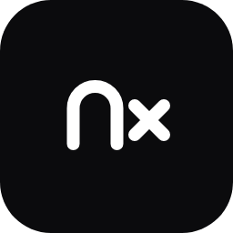
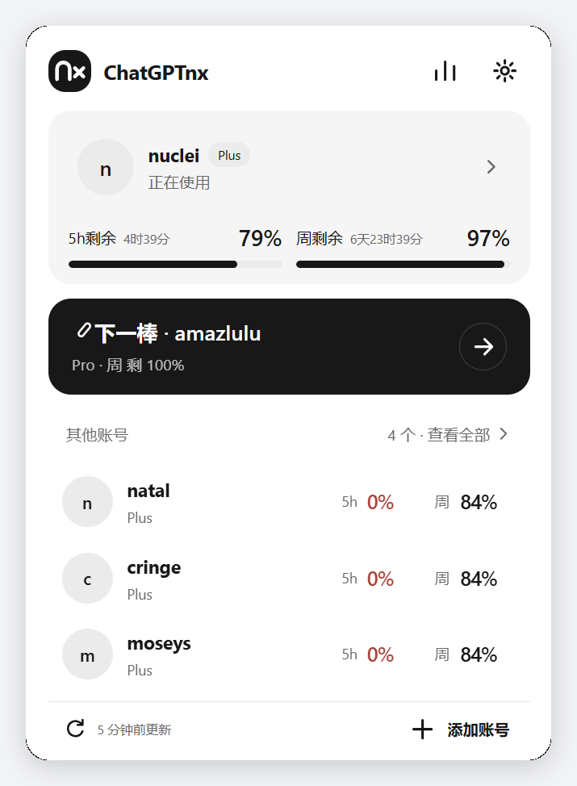
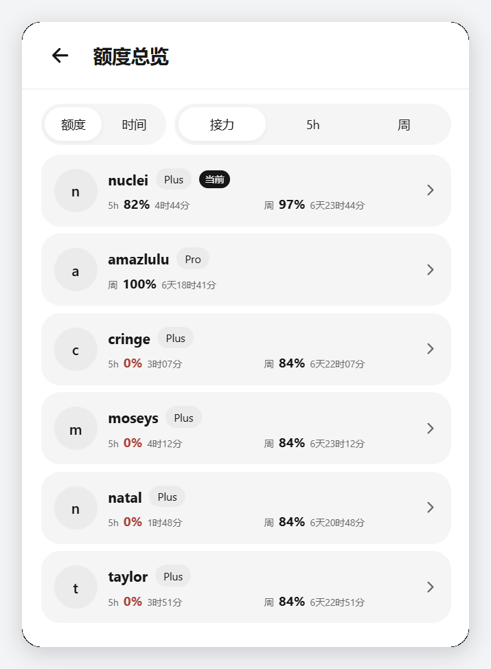
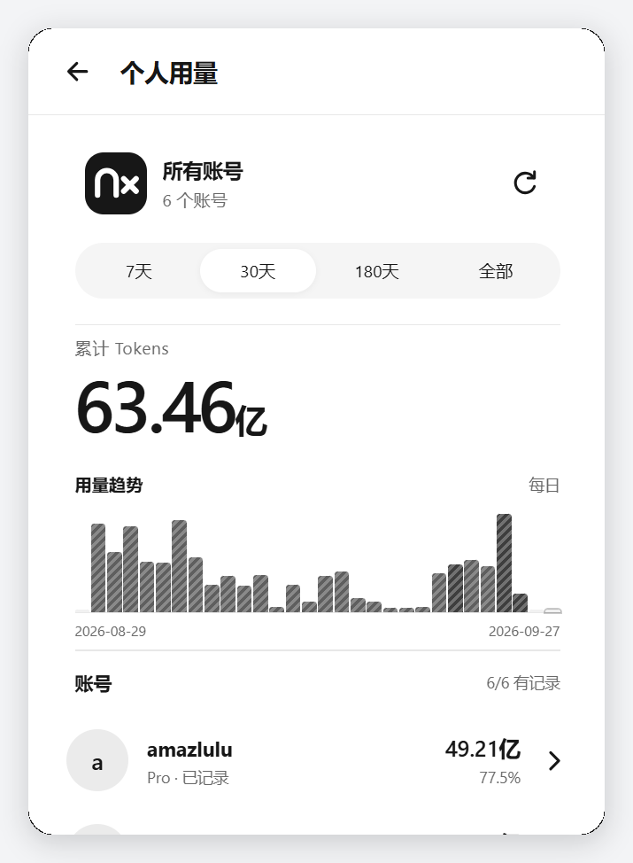
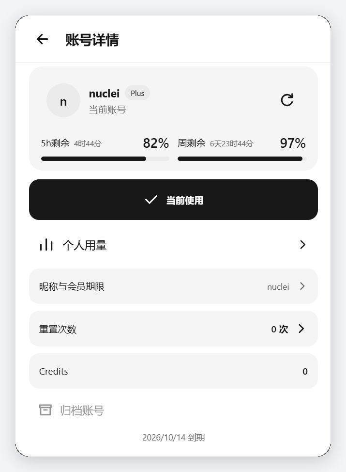
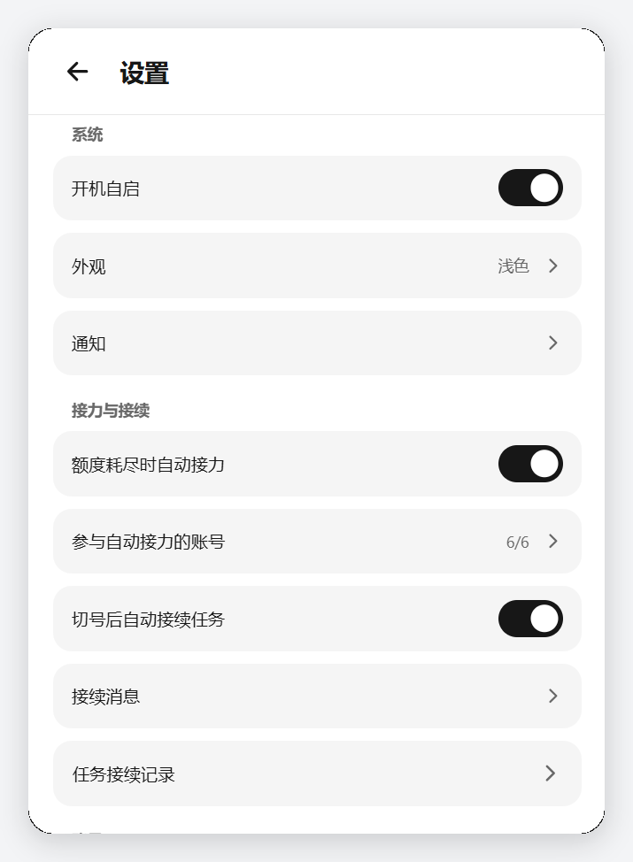
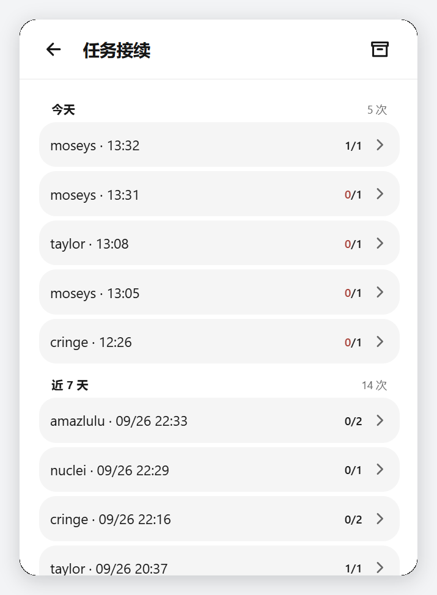

<h1>ChatGPTnx</h1>

<b>多账号额度面板 · 自动接力 · 任务接续</b>

在 Windows 桌面集中查看自有 ChatGPT / Codex 账号的额度和用量。

## 功能

- **额度与用量**：查看各账号的额度窗口、剩余比例、重置时间和个人 Token 用量。查询失败时显示不可用，不用零值代替未知数据。
- **账号接力**：手动切换账号，或选择参与账号，在额度耗尽时按顺序尝试自动切换。
- **任务接续**：切号后尝试在原 ChatGPT 桌面任务中点击原生继续按钮；没有按钮时，输入配置的接续消息并调用发送按钮。
- **桌面操作**：常驻托盘，提供通知、快捷键、外观和接续消息设置。

### 任务接续的输入行为

自动接续**不检查输入框是否已有文字或附件**，不会因草稿进入等待。没有原生继续按钮时，程序在输入框当前光标位置输入接续消息，再尝试发送。输入框原有内容可能一同发送，请按自己的使用方式决定是否启用自动接续。

接续只针对可明确定位的现有桌面任务。窗口、任务或发送结果无法确认时，程序记录原因；可能已经发送的消息不会自动重发。

## 界面

| 首页 | 额度总览 | 个人用量 |
| --- | --- | --- |
|  |  |  |

| 账号详情 | 设置 | 任务接续 |
| --- | --- | --- |
|  |  |  |

## 下载与运行

从 [Releases](../../releases) 下载 `ChatGPTnx.exe`，按 Release 页面提供的 SHA-256 核对文件。需要 Windows 10 / 11 64 位、已安装并登录的 ChatGPT 桌面应用，以及 Microsoft Edge WebView2 Runtime。

将 EXE 放入独立、可写的目录后启动。程序常驻托盘，关闭面板后仍会运行；可从托盘菜单退出。升级前请退出旧程序，并备份运行目录。

## 数据与隐私

运行数据保存在 EXE 同目录的 `accounts.txt`、`snapshots/` 和 `_data/` 中，可能包含账号状态、任务标题和日志。反馈问题前请移除邮箱、令牌、任务 ID、标题与本机路径；不要上传整个运行目录。

## 说明

ChatGPTnx 依赖 ChatGPT 桌面应用和服务接口的现有行为；客户端或接口变化可能影响查询、切号与接续。本项目与 OpenAI 没有隶属或认可关系。软件为闭源作品；使用与授权条款见 [LICENSE](LICENSE)。
